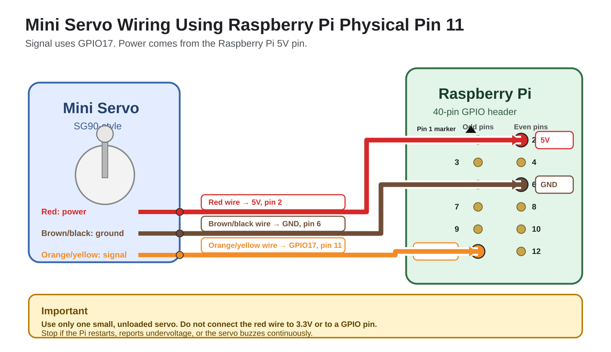

# Raspberry Pi Mini Servo Control

This project connects one small mini servo, such as an SG90, directly to a Raspberry Pi and moves it smoothly through the following angles:

```text
30° → 60° → 90° → 120° → 150° → 120° → 90° → 60° → 30°
```

The sequence repeats until the program is stopped with `Ctrl+C`.

> [!WARNING]
> Powering a servo directly from the Raspberry Pi is suitable only for brief testing with one small, unloaded servo. Stop immediately if the Raspberry Pi restarts, reports undervoltage, or the servo buzzes continuously.

## Wiring diagram

Place `raspberry_pi_servo_pin11_wiring.png` in the same directory as this README file.



## Connections

| Servo wire | Raspberry Pi connection |
|---|---|
| Orange, yellow, or white signal wire | GPIO17, physical pin 11 |
| Red power wire | 5V, physical pin 2 |
| Brown or black ground wire | GND, physical pin 6 |

Physical pin 11 is GPIO17. GPIO Zero uses BCM GPIO numbering, so the program uses `17`.

Do not connect the red servo wire to a GPIO pin or the 3.3V pin.

## Requirements

- Raspberry Pi with a 40-pin GPIO header
- Small mini servo, such as an SG90
- Three jumper wires
- Raspberry Pi OS
- Reliable Raspberry Pi power adapter

## Install GPIO Zero

Open a terminal and run:

```bash
sudo apt update
sudo apt install -y python3-gpiozero
```

## Create the Python program

Create a file named `servo_sweep.py`:

```bash
nano servo_sweep.py
```

Paste the following program:

```python
from gpiozero import AngularServo
from time import sleep

# Physical pin 11 is BCM GPIO17.
SERVO_GPIO = 17

# Change these values if your servo needs calibration.
MIN_PULSE_WIDTH = 0.0005
MAX_PULSE_WIDTH = 0.0025

# The servo will move through these target angles and then return.
TARGET_ANGLES = [30, 60, 90, 120, 150, 120, 90, 60, 30]

# Delay between one-degree movements.
# Increase this value for slower movement.
STEP_DELAY_SECONDS = 0.02

# Pause after reaching each target angle.
TARGET_PAUSE_SECONDS = 0.5


servo = AngularServo(
    SERVO_GPIO,
    min_angle=0,
    max_angle=180,
    min_pulse_width=MIN_PULSE_WIDTH,
    max_pulse_width=MAX_PULSE_WIDTH,
    initial_angle=None,
)


def move_smoothly(current_angle: int, target_angle: int) -> int:
    """Move the servo one degree at a time toward the target angle."""
    if current_angle < target_angle:
        step = 1
    else:
        step = -1

    for angle in range(current_angle, target_angle, step):
        servo.angle = angle
        sleep(STEP_DELAY_SECONDS)

    servo.angle = target_angle
    return target_angle


try:
    current_angle = 30
    servo.angle = current_angle
    sleep(1)

    print("Servo sweep started. Press Ctrl+C to stop.")

    while True:
        for target_angle in TARGET_ANGLES:
            print(f"Moving to {target_angle} degrees")
            current_angle = move_smoothly(current_angle, target_angle)
            sleep(TARGET_PAUSE_SECONDS)

except KeyboardInterrupt:
    print("\nServo sweep stopped.")

finally:
    servo.detach()
```

Save the file in Nano:

1. Press `Ctrl+O`
2. Press `Enter`
3. Press `Ctrl+X`

## Run the program

```bash
python3 servo_sweep.py
```

Stop it with:

```text
Ctrl+C
```

## Adjust the movement speed

For slower movement, increase:

```python
STEP_DELAY_SECONDS = 0.02
```

For example:

```python
STEP_DELAY_SECONDS = 0.05
```

For faster movement, decrease it slightly:

```python
STEP_DELAY_SECONDS = 0.01
```

## Change the angles

Edit this line:

```python
TARGET_ANGLES = [30, 60, 90, 120, 150, 120, 90, 60, 30]
```

For example, to move only between 30° and 60°:

```python
TARGET_ANGLES = [30, 60, 30]
```

Avoid commanding the servo beyond its safe mechanical range. If it buzzes strongly or reaches a hard stop, stop the program and reduce the maximum angle.

## Troubleshooting

### The servo does not move

Check that:

- The signal wire is connected to physical pin 11
- The program uses GPIO number `17`
- The red wire is connected to physical pin 2
- The ground wire is connected to physical pin 6

### The servo moves in the wrong direction

This is normal for some servo orientations. Reverse the angle sequence:

```python
TARGET_ANGLES = [150, 120, 90, 60, 30, 60, 90, 120, 150]
```

### The servo shakes or buzzes

Stop the program and check the wiring. You may also need to calibrate these values:

```python
MIN_PULSE_WIDTH = 0.0005
MAX_PULSE_WIDTH = 0.0025
```

Try a narrower range, such as:

```python
MIN_PULSE_WIDTH = 0.0007
MAX_PULSE_WIDTH = 0.0023
```

### The Raspberry Pi restarts

The servo is drawing more power than the Raspberry Pi can safely provide. Remove any mechanical load and use a proper external 5V servo supply before continuing.
